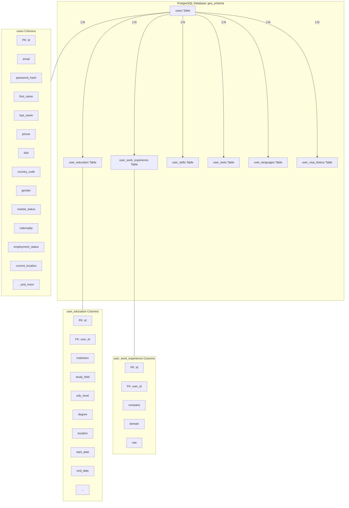

# GES Database Structure

This file consolidates the database schema and a visual overview.

## ER Diagram (Mermaid)



## SQL Schema

The canonical schema is in `server/schema.sql`. For convenience, the SQL is duplicated below.

```sql
-- schema.sql (canonical)
CREATE SCHEMA IF NOT EXISTS ges_schema;

-- Create Users Table
CREATE TABLE IF NOT EXISTS ges_schema.users (
    id SERIAL PRIMARY KEY,
    email VARCHAR(255) UNIQUE NOT NULL,
    password_hash TEXT NOT NULL,
    first_name VARCHAR(100),
    last_name VARCHAR(100),
    middle_name VARCHAR(100),
    phone VARCHAR(20),
    dob DATE,
    country_code VARCHAR(10),
    gender VARCHAR(20),
    marital_status VARCHAR(50),
    nationality VARCHAR(100),
    alt_phone VARCHAR(20),
    nickname VARCHAR(100),
    employment_status VARCHAR(100),
    skype_id VARCHAR(100),
    landline VARCHAR(20),
    github_id VARCHAR(255),
    linkedin_id VARCHAR(255),
    current_location VARCHAR(100),
    purpose VARCHAR(100),
    target_country VARCHAR(100),
    created_at TIMESTAMP WITH TIME ZONE DEFAULT CURRENT_TIMESTAMP,
    updated_at TIMESTAMP WITH TIME ZONE DEFAULT CURRENT_TIMESTAMP
);

-- Migration for existing users
DO $$ 
BEGIN 
    ALTER TABLE ges_schema.users ADD COLUMN IF NOT EXISTS middle_name VARCHAR(100);
    ALTER TABLE ges_schema.users ADD COLUMN IF NOT EXISTS gender VARCHAR(20);
    ALTER TABLE ges_schema.users ADD COLUMN IF NOT EXISTS marital_status VARCHAR(50);
    ALTER TABLE ges_schema.users ADD COLUMN IF NOT EXISTS nationality VARCHAR(100);
    ALTER TABLE ges_schema.users ADD COLUMN IF NOT EXISTS alt_phone VARCHAR(20);
    ALTER TABLE ges_schema.users ADD COLUMN IF NOT EXISTS nickname VARCHAR(100);
    ALTER TABLE ges_schema.users ADD COLUMN IF NOT EXISTS employment_status VARCHAR(100);
    ALTER TABLE ges_schema.users ADD COLUMN IF NOT EXISTS skype_id VARCHAR(100);
    ALTER TABLE ges_schema.users ADD COLUMN IF NOT EXISTS landline VARCHAR(20);
    ALTER TABLE ges_schema.users ADD COLUMN IF NOT EXISTS github_id VARCHAR(255);
    ALTER TABLE ges_schema.users ADD COLUMN IF NOT EXISTS linkedin_id VARCHAR(255);
    ALTER TABLE ges_schema.users ADD COLUMN IF NOT EXISTS current_location VARCHAR(100);
    ALTER TABLE ges_schema.users ADD COLUMN IF NOT EXISTS purpose VARCHAR(100);
    ALTER TABLE ges_schema.users ADD COLUMN IF NOT EXISTS target_country VARCHAR(100);
EXCEPTION
    WHEN others THEN NULL;
END $$;

-- Create Saved Jobs Table
CREATE TABLE IF NOT EXISTS GES_schema.saved_jobs (
    id SERIAL PRIMARY KEY,
    user_id INTEGER REFERENCES GES_schema.users(id) ON DELETE CASCADE,
    job_id VARCHAR(100) NOT NULL, -- Assuming job IDs are strings from a catalog
    saved_at TIMESTAMP WITH TIME ZONE DEFAULT CURRENT_TIMESTAMP,
    UNIQUE(user_id, job_id)
);

-- Create Applications Table
CREATE TABLE IF NOT EXISTS GES_schema.applications (
    id SERIAL PRIMARY KEY,
    user_id INTEGER REFERENCES GES_schema.users(id) ON DELETE CASCADE,
    job_id VARCHAR(100) NOT NULL,
    status VARCHAR(50) DEFAULT 'pending',
    applied_at TIMESTAMP WITH TIME ZONE DEFAULT CURRENT_TIMESTAMP
);

-- Create Job Search Logs Table
CREATE TABLE IF NOT EXISTS GES_schema.job_search_logs (
    id SERIAL PRIMARY KEY,
    user_id INTEGER REFERENCES GES_schema.users(id) ON DELETE SET NULL,
    search_query TEXT NOT NULL,
    created_at TIMESTAMP WITH TIME ZONE DEFAULT CURRENT_TIMESTAMP
);
-- Education Table
CREATE TABLE IF NOT EXISTS ges_schema.user_education (
    id SERIAL PRIMARY KEY,
    user_id INTEGER REFERENCES ges_schema.users(id) ON DELETE CASCADE,
    institution VARCHAR(255),
    study_field VARCHAR(255),
    edu_level VARCHAR(50),
    degree VARCHAR(255),
    location VARCHAR(100),
    is_highest BOOLEAN DEFAULT FALSE,
    start_month VARCHAR(20),
    start_year VARCHAR(10),
    end_month VARCHAR(20),
    end_year VARCHAR(10),
    course_type VARCHAR(100),
    study_mode VARCHAR(100),
    medium VARCHAR(100),
    division VARCHAR(100),
    score_type VARCHAR(20),
    score_value VARCHAR(20),
    info TEXT,
    created_at TIMESTAMP WITH TIME ZONE DEFAULT CURRENT_TIMESTAMP
);

-- Work Experience Table
CREATE TABLE IF NOT EXISTS ges_schema.user_work_experience (
    id SERIAL PRIMARY KEY,
    user_id INTEGER REFERENCES ges_schema.users(id) ON DELETE CASCADE,
    company VARCHAR(255),
    domain VARCHAR(255),
    role VARCHAR(255),
    location VARCHAR(100),
    is_current BOOLEAN DEFAULT FALSE,
    start_month VARCHAR(20),
    start_year VARCHAR(10),
    end_month VARCHAR(20),
    end_year VARCHAR(10),
    employment_type VARCHAR(100),
    industry VARCHAR(100),
    responsibilities TEXT,
    achievements TEXT,
    info TEXT,
    created_at TIMESTAMP WITH TIME ZONE DEFAULT CURRENT_TIMESTAMP
);

-- Skills Table
CREATE TABLE IF NOT EXISTS ges_schema.user_skills (
    id SERIAL PRIMARY KEY,
    user_id INTEGER REFERENCES ges_schema.users(id) ON DELETE CASCADE,
    skill_name VARCHAR(100),
    created_at TIMESTAMP WITH TIME ZONE DEFAULT CURRENT_TIMESTAMP
);

-- Tests Table
CREATE TABLE IF NOT EXISTS ges_schema.user_tests (
    id SERIAL PRIMARY KEY,
    user_id INTEGER REFERENCES ges_schema.users(id) ON DELETE CASCADE,
    test_name VARCHAR(100),
    score VARCHAR(50),
    taken_month VARCHAR(20),
    taken_year VARCHAR(10),
    valid_month VARCHAR(20),
    valid_year VARCHAR(10),
    created_at TIMESTAMP WITH TIME ZONE DEFAULT CURRENT_TIMESTAMP
);

-- Languages Table
CREATE TABLE IF NOT EXISTS ges_schema.user_languages (
    id SERIAL PRIMARY KEY,
    user_id INTEGER REFERENCES ges_schema.users(id) ON DELETE CASCADE,
    name VARCHAR(100),
    overall VARCHAR(50),
    listening VARCHAR(50),
    speaking VARCHAR(50),
    reading VARCHAR(50),
    writing VARCHAR(50),
    created_at TIMESTAMP WITH TIME ZONE DEFAULT CURRENT_TIMESTAMP
);

-- Visa History Table
CREATE TABLE IF NOT EXISTS ges_schema.user_visa_history (
    id SERIAL PRIMARY KEY,
    user_id INTEGER REFERENCES ges_schema.users(id) ON DELETE CASCADE,
    type VARCHAR(100),
    country VARCHAR(100),
    specification VARCHAR(255),
    valid_date VARCHAR(10),
    valid_month VARCHAR(20),
    valid_year VARCHAR(10),
    created_at TIMESTAMP WITH TIME ZONE DEFAULT CURRENT_TIMESTAMP
);
```

## Notes
- Canonical SQL file: `server/schema.sql`.
- To apply the schema to a PostgreSQL database (adjust connection parameters), run:

```bash
psql -h $DB_HOST -p $DB_PORT -U $DB_USER -d $DB_NAME -f server/schema.sql
```

- Sensitive files: `server/.env` is not tracked (see `.gitignore`). Create `server/.env` from `server/.env.example` locally and do not commit secrets.

